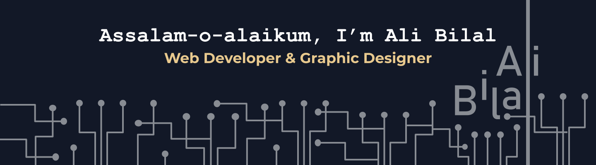

## About Me
I’m Ali Bilal from Islamabad, Pakistan, specializing in Full Stack Web Development and Graphic Design. I have a strong passion for working with cutting-edge technologies and frameworks like React and Next.js. In addition to my web development skills, I excel in graphic design, including logo branding, UI/UX design, and print media.

## Connect with me:

<!-- <a href="http://www.AliBilal.com/" title="AliBilal.com">
  <picture>
    <source media="(prefers-color-scheme: dark)" srcset="./img/connect-with-me-section/globe-dark.svg">
    <source media="(prefers-color-scheme: light)" srcset="./img/connect-with-me-section/globe-light.svg">
    
  </picture>
</a>&nbsp;&nbsp; -->
<a href="mailto:MrAliBilal@Outlook.com" title="Email: MrAliBilal@Outlook.com">
  <picture>
    <source media="(prefers-color-scheme: dark)" srcset="./img/connect-with-me-section/email-dark.svg">
    <source media="(prefers-color-scheme: light)" srcset="./img/connect-with-me-section/email-light.svg">
    
  </picture>
</a>&nbsp;&nbsp;
<a href="https://linkedin.com/in/MrAliBilal" title="LinkedIn: MrAliBilal">
  <picture>
    <source media="(prefers-color-scheme: dark)" srcset="./img/connect-with-me-section/linkedin-dark.svg">
    <source media="(prefers-color-scheme: light)" srcset="./img/connect-with-me-section/linkedin-light.svg">
    
  </picture>
</a>&nbsp;&nbsp;
<!-- <a href="http://discordapp.com/users/MrAliBilal" title="Discord: MrAliBilal">
  <picture>
    <source media="(prefers-color-scheme: dark)" srcset="./img/connect-with-me-section/discord-dark.svg">
    <source media="(prefers-color-scheme: light)" srcset="./img/connect-with-me-section/discord-light.svg">
    
  </picture>
</a>&nbsp;&nbsp;
<a href="https://t.me/MrAlibilal" title="Telegram: MrAliBilal">
  <picture>
    <source media="(prefers-color-scheme: dark)" srcset="./img/connect-with-me-section/telegram-dark.svg">
    <source media="(prefers-color-scheme: light)" srcset="./img/connect-with-me-section/telegram-light.svg">
    
  </picture>
</a>&nbsp;&nbsp;
<a href="https://www.instagram.com/Mr.AliBilal" title="Instagram: Mr.AliBilal">
  <picture>
    <source media="(prefers-color-scheme: dark)" srcset="./img/connect-with-me-section/instagram-dark.svg">
    <source media="(prefers-color-scheme: light)" srcset="./img/connect-with-me-section/instagram-light.svg">
    
  </picture>
</a>&nbsp;&nbsp;
<a href="https://www.youtube.com/@MrAliBilal" title="Youtube: @MrAliBilal">
  <picture>
    <source media="(prefers-color-scheme: dark)" srcset="./img/connect-with-me-section/youtube-dark.svg">
    <source media="(prefers-color-scheme: light)" srcset="./img/connect-with-me-section/youtube-light.svg">
    
  </picture>
</a> -->

## Tech Stack & Tools

### Languages:

&nbsp;&nbsp;
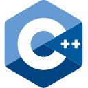
&nbsp;&nbsp;
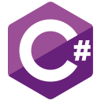
&nbsp;&nbsp;

&nbsp;&nbsp;

&nbsp;&nbsp;

&nbsp;&nbsp;

&nbsp;&nbsp;

&nbsp;&nbsp;

&nbsp;&nbsp;

&nbsp;&nbsp;

### Framework:

&nbsp;&nbsp;

&nbsp;&nbsp;
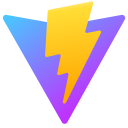
&nbsp;&nbsp;

&nbsp;&nbsp;
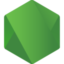
&nbsp;&nbsp;

&nbsp;&nbsp;
&nbsp;&nbsp;

### Database:

&nbsp;&nbsp;

### Tools:
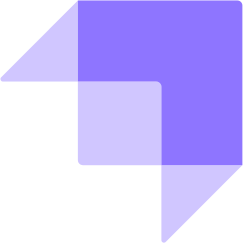
&nbsp;&nbsp;

&nbsp;&nbsp;

&nbsp;&nbsp;
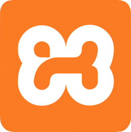
&nbsp;&nbsp;

&nbsp;&nbsp;
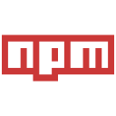
&nbsp;&nbsp;

### Integrated development environment IDE:

&nbsp;&nbsp;

&nbsp;&nbsp;
: Visual Studio")
&nbsp;&nbsp;
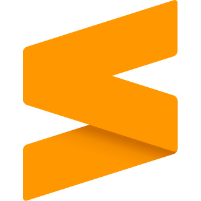
&nbsp;&nbsp;
: IntelliJ")
&nbsp;&nbsp;
: CodeLite ")
&nbsp;&nbsp;
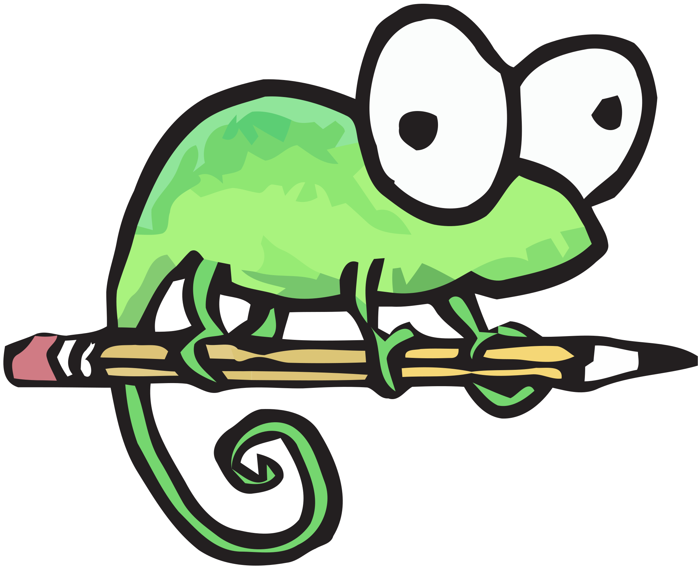
&nbsp;&nbsp;
: Dev-C++")
&nbsp;&nbsp;

&nbsp;&nbsp;

### Version Control:

&nbsp;&nbsp;

### Graphics Designing Tool:
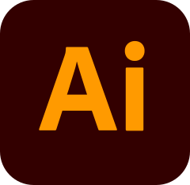
&nbsp;&nbsp;

&nbsp;&nbsp;
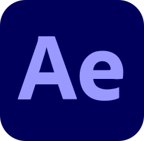
&nbsp;&nbsp;

&nbsp;&nbsp;

&nbsp;&nbsp;

&nbsp;&nbsp;

## My Stats:

  <a href="https://github.com/MrAliBilal?tab=repositories" title="GitHub: Stats">
    <picture>
      <source media="(prefers-color-scheme: dark)" height=200 srcset="https://github-readme-stats.vercel.app/api?username=MrAliBilal&show_icons=true&count_private=true&theme=github_dark&card_width=400&rank_icon=github&bg_color=24292F&border_color=373E47">
      
    </picture>
  </a>
  <a href="https://github.com/MrAliBilal?tab=repositories" title="GitHub: Most Used Programing Language">
    <picture>
      <source media="(prefers-color-scheme: dark)" height=200 srcset="https://github-readme-stats.vercel.app/api/top-langs?username=MrAliBilal&layout=compact&theme=github_dark&langs_count=8&card_width=300&bg_color=24292F&border_color=373E47">
      
    </picture>
  </a>
  <a href="https://git.io/streak-stats" title="GitHub: Streak">
    <picture>
      <source media="(prefers-color-scheme: dark)" srcset="https://streak-stats.demolab.com?user=MrAliBilal&theme=github-dark-dimmed&border_radius=4&card_width=600&card_height=200">
      
    </picture>
  </a>

<!-- 

      <picture>
      <source media="(prefers-color-scheme: dark)" srcset="https://capsule-render.vercel.app/api?type=waving&height=100&color=0:2b2d42,50:8d99ae,100:414345&text=Ali%20Bilal&section=footer&fontColor=ffffff&fontSize=20&fontAlign=50&fontAlignY=85&animation=twinkling">
      
    </picture>

 -->
