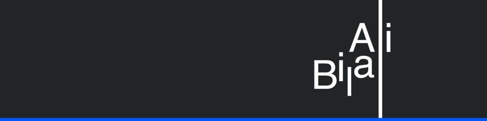
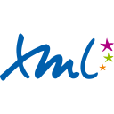
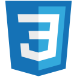
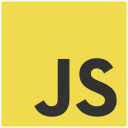
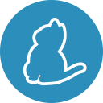
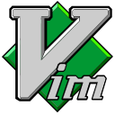
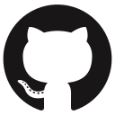
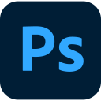
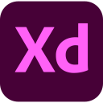
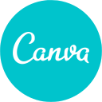

# 🌟 Ali Bilal
**`Full Stack Web Developer | Graphic Designer`**  
**`Bachelor of Science in Computer Science (BSCS)`**  
**`Islamabad, Pakistan`**

## About Me
I’m Ali Bilal from Islamabad, Pakistan, specializing in Full Stack Web Development and Graphic Design. I have a strong passion for working with cutting-edge technologies and frameworks like React and Next.js. In addition to my web development skills, I excel in graphic design, including logo branding, UI/UX design, and print media.

## Connect with me:

<a href="http://www.AliBilal.com/" title="AliBilal.com">
  <picture>
    <source media="(prefers-color-scheme: dark)" srcset="./img/connect-with-me-section/globe-dark.svg">
    <source media="(prefers-color-scheme: light)" srcset="./img/connect-with-me-section/globe-light.svg">
    
  </picture>
</a>&nbsp;&nbsp;
<a href="mailto:MrAliBilal@Outlook.com" title="Email: MrAliBilal@Outlook.com">
  <picture>
    <source media="(prefers-color-scheme: dark)" srcset="./img/connect-with-me-section/email-dark.svg">
    <source media="(prefers-color-scheme: light)" srcset="./img/connect-with-me-section/email-light.svg">
    
  </picture>
</a>&nbsp;&nbsp;
<a href="https://linkedin.com/in/MrAliBilal" title="LinkedIn: MrAliBilal">
  <picture>
    <source media="(prefers-color-scheme: dark)" srcset="./img/connect-with-me-section/linkedin-dark.svg">
    <source media="(prefers-color-scheme: light)" srcset="./img/connect-with-me-section/linkedin-light.svg">
    
  </picture>
</a>&nbsp;&nbsp;
<a href="http://discordapp.com/users/MrAliBilal" title="Discord: MrAliBilal">
  <picture>
    <source media="(prefers-color-scheme: dark)" srcset="./img/connect-with-me-section/discord-dark.svg">
    <source media="(prefers-color-scheme: light)" srcset="./img/connect-with-me-section/discord-light.svg">
    
  </picture>
</a>&nbsp;&nbsp;
<a href="https://t.me/MrAlibilal" title="Telegram: MrAliBilal">
  <picture>
    <source media="(prefers-color-scheme: dark)" srcset="./img/connect-with-me-section/telegram-dark.svg">
    <source media="(prefers-color-scheme: light)" srcset="./img/connect-with-me-section/telegram-light.svg">
    
  </picture>
</a>&nbsp;&nbsp;
<a href="https://www.instagram.com/Mr.AliBilal" title="Instagram: Mr.AliBilal">
  <picture>
    <source media="(prefers-color-scheme: dark)" srcset="./img/connect-with-me-section/instagram-dark.svg">
    <source media="(prefers-color-scheme: light)" srcset="./img/connect-with-me-section/instagram-light.svg">
    
  </picture>
</a>&nbsp;&nbsp;
<a href="https://www.youtube.com/@MrAliBilal" title="Youtube: @MrAliBilal">
  <picture>
    <source media="(prefers-color-scheme: dark)" srcset="./img/connect-with-me-section/youtube-dark.svg">
    <source media="(prefers-color-scheme: light)" srcset="./img/connect-with-me-section/youtube-light.svg">
    
  </picture>
</a>

## Tech Stack & Tools

### Languages:

&nbsp;&nbsp;

&nbsp;&nbsp;

&nbsp;&nbsp;

&nbsp;&nbsp;

&nbsp;&nbsp;

&nbsp;&nbsp;

&nbsp;&nbsp;

&nbsp;&nbsp;

&nbsp;&nbsp;

&nbsp;&nbsp;

### Framework:

&nbsp;&nbsp;

&nbsp;&nbsp;

&nbsp;&nbsp;

&nbsp;&nbsp;

&nbsp;&nbsp;

&nbsp;&nbsp;

&nbsp;&nbsp;

### Database:

&nbsp;&nbsp;

### Tools:

&nbsp;&nbsp;

&nbsp;&nbsp;

&nbsp;&nbsp;

&nbsp;&nbsp;

&nbsp;&nbsp;

### Integrated development environment IDE:

&nbsp;&nbsp;

&nbsp;&nbsp;
: Visual Studio")
&nbsp;&nbsp;

&nbsp;&nbsp;
: IntelliJ")
&nbsp;&nbsp;
: CodeLite ")
&nbsp;&nbsp;

&nbsp;&nbsp;
<!-- : Dev-C++")
&nbsp;&nbsp;
: Turbo c++")
&nbsp;&nbsp;

&nbsp;&nbsp;
 -->

### Version Control:

&nbsp;&nbsp;

### Graphics Designing Tool:

&nbsp;&nbsp;

&nbsp;&nbsp;

&nbsp;&nbsp;

&nbsp;&nbsp;

&nbsp;&nbsp;

&nbsp;&nbsp;
<!--  -->

<!-- 

  

   -->

<!--
**MrAliBilal/MrAliBilal** is a ✨ _special_ ✨ repository because its `README.md` (this file) appears on your GitHub profile.

Here are some ideas to get you started:

- 🔭 I’m currently working on ...
- 🌱 I’m currently learning ...
- 👯 I’m looking to collaborate on ...
- 🤔 I’m looking for help with ...
- 💬 Ask me about ...
- 📫 How to reach me: ...
- 😄 Pronouns: ...
- ⚡ Fun fact: ...

## Hi there 👋

I’m Ali Bilal from Islamabad, Pakistan, specializing in Full Stack Web Development and Graphic Design. I have a strong passion for working with cutting-edge technologies and frameworks like React and Next.js. In addition to my web development skills, I excel in graphic design, including logo branding, UI/UX design, and print media.

-->
